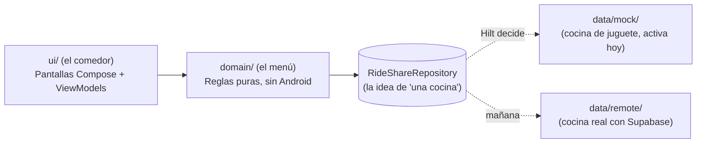
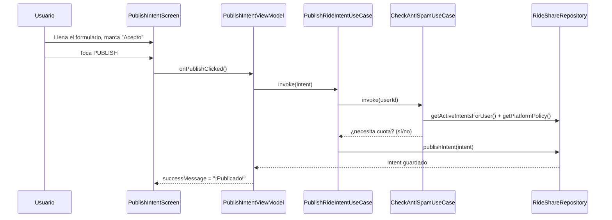
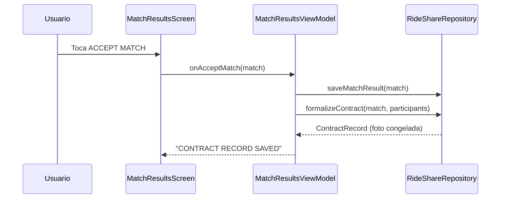

# Anatomía de Meta-Match Finder

*Una guía de arquitectura para quien nunca ha leído Kotlin — pensada para
leerse con el código abierto al lado.*

> Este documento es distinto a `CLAUDE.md` (que es un mapa denso, escrito
> para que un agente de IA no tenga que leer cada archivo) y a
> `README.md` (que es la portada del proyecto). Este es el recorrido
> **pedagógico**: si nunca has programado en Kotlin ni en Android, este
> documento te lleva de la mano, archivo por archivo, explicando tanto la
> lógica de negocio como la sintaxis que te vas a encontrar.

---

## 0. Antes de empezar: ¿qué problema resuelve esta app?

Wishing Well (nombre del producto) — construida sobre el motor
**MetaMatch** (nombre del motor, y el nombre del paquete de código
`com.metamatch.app`) — resuelve un problema genérico:

> "Tengo un deseo/necesidad muy específica (compartir un viaje, compartir
> una pizza, encontrar roomie). Alguien más, cerca de mí, tiene un deseo
> compatible con el mío. ¿Cómo los emparejo automáticamente, con reglas
> de negocio (límites gratuitos, filtros de seguridad, reputación) que no
> tengo que reinventar cada vez que agrego un tipo de deseo nuevo?"

La apuesta de diseño es que ese "motor de emparejamiento" (el *meta-match*)
se construye **una sola vez**, y cada tipo de deseo concreto (Ride, y en
el futuro Pizza, Roomie) es una pieza que se conecta a ese motor sin
tener que reescribirlo.

Todo lo que sigue explica *cómo* está construido ese motor, en Kotlin.

---

## 1. La idea que organiza todo el código: Clean Architecture

Imagina un restaurante:

- **El menú y las recetas** (`domain/`) — las reglas de qué es un platillo
  válido, cuánto cuesta, qué ingredientes lleva. No les importa si la
  cocina es de gas o eléctrica, ni si el mesero usa una libreta o una
  tablet. Son reglas puras.
- **La cocina** (`data/`) — donde realmente se preparan los platillos.
  Hoy es una cocina de juguete (`MockRideShareRepository`, datos en
  memoria, inventados); en el futuro será una cocina real conectada a
  Supabase (`SupabaseRideShareRepository`).
- **El comedor** (`ui/`) — lo que el cliente ve y toca: el menú impreso,
  los botones, las pantallas.
- **El gerente** (`di/`, con Hilt) — decide, un solo día, qué cocina está
  activa (¿la de juguete o la real?) y le entrega a cada mesero el menú
  correcto sin que el mesero tenga que saberlo.

La regla de oro (repetida en `CLAUDE.md`): **el comedor y el menú nunca
hablan directamente con una cocina específica** — sólo con la idea
abstracta de "una cocina" (`RideShareRepository`, una `interface`). Así,
cambiar de cocina de juguete a cocina real es cambiar **una sola línea**
en todo el proyecto (`di/RepositoryModule.kt`).



---

## 2. Mapa de carpetas (con una frase por carpeta)

```
app/src/main/java/com/metamatch/app/
│
├── domain/                  ← EL MENÚ: Kotlin puro, sin nada de Android
│   ├── model/                 Los "sustantivos" del negocio
│   │   ├── ContractIntent.kt    "Quiero que me empareje con alguien para X"
│   │   ├── RideShareIntent.kt   La versión concreta para viajes compartidos
│   │   ├── MatchResult.kt       El resultado de un emparejamiento exitoso
│   │   ├── ContractRecord.kt    La "foto congelada" de un match aceptado
│   │   ├── UserIntegrityScore.kt La reputación de un usuario (0.0–5.0)
│   │   ├── UserRule.kt          Listas negras / listas blancas
│   │   └── GeoPoint.kt          Un punto lat/lng + matemáticas de distancia
│   ├── policy/
│   │   └── PlatformPolicy.kt    Los números configurables del negocio
│   ├── repository/
│   │   └── RideShareRepository.kt   La idea abstracta de "una cocina"
│   ├── usecase/               Los "verbos" del negocio (una acción cada uno)
│   │   ├── PublishRideIntentUseCase.kt
│   │   ├── FindMatchesUseCase.kt
│   │   └── CheckAntiSpamUseCase.kt
│   └── exception/
│       └── MicroFeeRequiredException.kt
│
├── data/                     ← LA COCINA: implementaciones concretas
│   ├── mock/
│   │   └── MockRideShareRepository.kt   Cocina de juguete (datos en memoria)
│   └── remote/
│       └── SupabaseRideShareRepository.kt   Cocina real (sin terminar aún)
│
├── di/                       ← EL GERENTE: quién decide qué cocina se usa
│   ├── RepositoryModule.kt     EL ÚNICO archivo que elige Mock vs. Supabase
│   └── DispatchersModule.kt
│
├── ui/                       ← EL COMEDOR: lo que el usuario ve y toca
│   ├── theme/                  El "uniforme" visual (colores, tipografía)
│   ├── components/              Piezas reutilizables (botón, tarjeta, badge)
│   │   ├── RetroButton.kt
│   │   ├── RetroCard.kt
│   │   ├── PixelBadge.kt
│   │   └── LegalNoticeCard.kt   El aviso legal + checkbox de consentimiento
│   ├── intro/
│   │   └── IntroScreen.kt       La primera pantalla: "Wishing Well"
│   ├── hub/
│   │   └── HubScreen.kt         El menú de "qué tipo de deseo quiero"
│   ├── publish/                 Pantalla + lógica para publicar un deseo (Ride)
│   └── match/                   Pantalla + lógica para ver/aceptar matches (Ride)
│
├── MainActivity.kt           La puerta de entrada + el mapa de navegación
└── MetaMatchApplication.kt   Arranca Hilt (el "gerente") cuando abre la app
```

---

## 3. Recorrido guiado, en el orden en que conviene leerlo

No leas el proyecto de arriba hacia abajo en el explorador de archivos —
léelo en este orden, que sigue el flujo real de una idea de negocio hasta
convertirse en pantalla.

### Paso 1 — `domain/model/ContractIntent.kt`: la idea más importante del proyecto

```kotlin
abstract class ContractIntent(
    open val id: String,
    open val creatorUserId: String,
    open val contractType: ContractType,
    open val createdAt: Instant,
    open val scheduledAt: Instant,
    open val expiresAt: Instant?,
    open val verificationTier: IdentityVerificationTier,
    open val financialTerms: FinancialTerms,
    open val status: ContractStatus,
    open val legalConsentAcknowledgedAt: Instant?,
)
```

**Qué es `abstract class`:** una clase que no se puede usar "tal cual" —
es un molde. Sólo tiene sentido a través de una clase concreta que la
extienda (ver Paso 2). Piénsalo como la palabra "vehículo": nunca compras
"un vehículo", compras un auto o una moto — pero "vehículo" describe lo
que todos tienen en común (ruedas, motor).

**Qué es `open val`:** un campo que las clases hijas pueden *sobrescribir*
con su propio valor. Sin `open`, Kotlin no lo permitiría (Kotlin es
"cerrado por default" — hay que pedir explícitamente permiso para
heredar).

**Por qué importa para Roomie y Pizza (que aún no existen):** el día que
se construya `RoommateIntent` o `PizzaShareIntent`, ambas van a heredar de
esta misma clase — y automáticamente van a tener reputación, límites
gratuitos, y (desde la Etapa 1) un consentimiento legal registrado, sin
escribir ese código de nuevo. Ese es el punto de tener esta clase.

### Paso 2 — `domain/model/RideShareIntent.kt`: la primera implementación concreta

```kotlin
data class RideShareIntent(
    override val id: String,
    // ...todos los campos de ContractIntent...
    val departure: GeoPoint,
    val destination: GeoPoint,
    val maxWalkingDistanceMeters: Double,
    val creatorEmail: String,
    val allowedEmailDomains: Set<String> = emptySet(),
    val blockedUserIds: Set<String> = emptySet(),
    override val legalConsentAcknowledgedAt: Instant? = null,
) : ContractIntent(/* ... */)
```

**Qué es `data class`:** le pide al compilador que genere automáticamente
`equals()` (¿son iguales estos dos objetos?), `toString()` (para
imprimirlo bonito) y `copy()` (crear una copia con un campo cambiado, sin
tocar el original). Es el molde ideal para "un objeto que sólo guarda
datos".

**`: ContractIntent(...)`** — esta es la herencia: "`RideShareIntent` ES
UN `ContractIntent`, más estos campos extra (`departure`, `destination`,
etc.) que sólo tienen sentido para un viaje compartido."

**Para Roomie/Pizza:** cuando llegue su etapa, vas a ver
`RoommateIntent`/`PizzaShareIntent` con exactamente esta misma forma —
hereda lo común, agrega lo específico.

### Paso 3 — `domain/repository/RideShareRepository.kt`: el contrato con "la cocina"

```kotlin
interface RideShareRepository {
    suspend fun getActiveIntentsForUser(userId: String): List<RideShareIntent>
    suspend fun getCandidateIntents(excludingUserId: String): List<RideShareIntent>
    fun observeActiveIntentsForUser(userId: String): Flow<List<RideShareIntent>>
    suspend fun publishIntent(intent: RideShareIntent): RideShareIntent
    suspend fun formalizeContract(match: MatchResult, participants: List<RideShareIntent>): ContractRecord
    // ...
}
```

**Qué es `interface`:** una lista de "promesas" — funciones que deben
existir, sin decir *cómo* se hacen. Es la versión en código de "necesito
que 'una cocina' sepa preparar estos platillos" sin importar si es de gas
o eléctrica.

**Qué es `suspend fun`:** una función que puede tardar (por ejemplo,
esperar una respuesta de internet) *sin congelar la pantalla* mientras
espera. Es la manera moderna de Kotlin de escribir código asíncrono que
se lee como si fuera síncrono.

**Qué es `Flow<List<RideShareIntent>>`:** un "caño" de datos que puede
emitir varios valores a través del tiempo (a diferencia de `suspend fun`,
que da un solo valor y termina). Se usa aquí para que la pantalla se
actualice sola cada vez que cambian los deseos activos del usuario, sin
que nadie tenga que refrescar manualmente.

### Paso 4 — `data/mock/MockRideShareRepository.kt`: la cocina de juguete

Esta clase implementa (`: RideShareRepository`) cada una de esas
promesas, pero con una lista en memoria (`MutableStateFlow`) en vez de una
base de datos real. Aquí viven los "usuarios sembrados" con los que
puedes emparejar apenas abres la app (María, Ana, Luis...).

```kotlin
@Singleton
class MockRideShareRepository @Inject constructor() : RideShareRepository {
```

**Qué es `@Singleton` / `@Inject`:** anotaciones de **Hilt** (la
herramienta de inyección de dependencias). `@Singleton` dice "sólo debe
existir UNA de estas en toda la app" (si hubiera dos, cada una tendría su
propia lista en memoria y los datos no coincidirían). `@Inject
constructor()` le dice a Hilt "tú puedes construir esta clase sin que
nadie más tenga que hacerlo a mano".

### Paso 5 — `domain/usecase/FindMatchesUseCase.kt`: el algoritmo de emparejamiento

Este archivo es el corazón del negocio: agrupa viajes compatibles por
horario, filtra por lista negra y dominio de correo, y va agregando
pasajeros mientras el punto de encuentro calculado (`GeoPoint.centroidOf`)
siga estando dentro de la tolerancia de caminata de **todos** los
miembros del grupo — no sólo del nuevo. Vale la pena leerlo completo una
vez que ya entendiste los pasos 1–4; sus propios comentarios WHAT/WHY/HOW
explican el algoritmo paso a paso.

### Paso 6 — `ui/publish/PublishIntentViewModel.kt` + `PublishIntentScreen.kt`: de la pantalla a la base de datos

Aquí conviene entender el patrón **MVVM** (Model-View-ViewModel) y el
patrón de **estado único** que usa todo el proyecto:

```kotlin
data class PublishUiState(
    val departureLat: String = "21.0894",
    // ...
    val legalConsentAcknowledged: Boolean = false,
    val isPublishing: Boolean = false,
    val errorMessage: String? = null,
    val successMessage: String? = null,
)
```

Toda la pantalla se describe con **un solo objeto inmutable**. Cuando el
usuario escribe algo, no se "muta" ese objeto — se reemplaza por una
copia nueva con `.copy(campo = nuevoValor)`:

```kotlin
fun onLegalConsentChanged(acknowledged: Boolean) {
    _uiState.update { it.copy(legalConsentAcknowledged = acknowledged) }
}
```

Y la pantalla (`PublishIntentScreen.kt`, un `@Composable`) simplemente
*lee* ese estado y se re-dibuja sola cuando cambia — nunca decide nada por
su cuenta:

```kotlin
val state by viewModel.uiState.collectAsState()
// ...
RetroButton(
    enabled = !state.isPublishing && state.legalConsentAcknowledged,
    onClick = viewModel::onPublishClicked,
)
```

**Por qué este patrón importa tanto:** significa que la lógica de negocio
(¿puedo publicar? ¿necesito cobrar una cuota?) vive en el ViewModel y en
los use cases — nunca en el archivo de la pantalla. Eso hace que la
lógica se pueda probar con `./gradlew testDebugUnitTest` sin necesitar un
emulador (ver `app/src/test/`).

### Paso 7 — `MainActivity.kt`: cómo se conectan las pantallas

Desde la Etapa 1 ("Wishing Well"), la navegación usa **Navigation-Compose**
en vez de un simple `if`/`when`:

```kotlin
NavHost(navController = navController, startDestination = Routes.INTRO) {
    composable(Routes.INTRO) { IntroScreen(onTossCoin = { navController.navigate(Routes.HUB) { ... } }) }
    composable(Routes.HUB)   { HubScreen(onOpenRide = { navController.navigate(Routes.RIDE) }) }
    composable(Routes.RIDE)  { RideVerticalScreen(navController = navController) }
}
```

Esto es literalmente una pila de pantallas: `Intro → Hub → Ride`. El botón
"← Hub" hace `navController.popBackStack()` — regresa un nivel en esa
pila, como el botón "atrás" del teléfono.

### Paso 8 — `domain/model/ContractRecord.kt`: "este match es, conceptualmente, un contrato"

Este archivo nació de un requisito explícito: cada match aceptado debe
guardar suficiente información como para —si algún día hiciera falta—
armar un contrato formal por escrito, sin que la app genere ningún PDF
hoy.

```kotlin
data class ContractRecord(
    val id: String,
    val matchResultId: String,
    val participants: List<ContractPartySnapshot>,
    val formalizedAt: Instant,
    // ...
)

data class ContractPartySnapshot(
    val userId: String,
    val email: String,
    val financialTerms: FinancialTerms,
    val verificationTier: IdentityVerificationTier,
    val legalConsentAcknowledgedAt: Instant?,
)
```

La palabra clave es **"foto congelada" (snapshot)**: estos datos se
copian tal cual estaban en el momento exacto en que alguien aceptó el
match — no son una referencia que pueda cambiar después. Si el usuario
edita su intent más tarde, el `ContractRecord` de un match ya aceptado no
se entera ni se altera. Esto importa mucho para Roomie (ver sección 5):
si el precio se negocia después, el historial de qué se acordó en cada
momento no debe perderse.

---

## 4. El viaje completo de una idea, de punta a punta



Y luego, al aceptar un match:



---

## 5. Cimientos legales para las próximas etapas (Pizza y Roomie)

> **Esta sección no es asesoría legal.** Es la traducción de un
> requisito de producto (qué campos de datos necesitamos) a partir de
> ideas generales sobre arrendamiento en México. Antes de que cualquier
> contrato real dependa de esto, se debe consultar a un abogado.

Ninguna de las dos verticales está construida todavía (ver
`CLAUDE.md`, sección "Not yet implemented"). Esta sección documenta los
requisitos ya reunidos, para que cuando llegue su etapa, el diseño del
`RoommateIntent` / `PizzaShareIntent` no tenga que inventarse desde cero.

### 5.1 Roomie — subarriendo/arrendamiento

La analogía correcta cambia según la duración de la estancia:

- **Estancia corta** (días/semanas) → se parece más a un contrato de
  **hospedaje** (como un hotel con un huésped): pocas formalidades,
  relación de servicio.
- **Estancia larga** (meses/años) → es un **arrendamiento** propiamente
  dicho, y la ley mexicana (Código Civil, con variantes estatales) espera
  que un contrato de este tipo contenga, como mínimo:
  1. Identificación de ambas partes (nombre completo, domicilio).
  2. Descripción y ubicación del inmueble.
  3. Monto de la renta y forma de pago.
  4. Depósito en garantía.
  5. Plazo/vigencia del contrato.
  6. Obligaciones de cada parte (mantenimiento, uso permitido, etc.).
  7. Causales de terminación anticipada.
  8. Un fiador/aval o garantía alternativa (varía por estado; CDMX, por
     ejemplo, permite alternativas al fiador tradicional).

**Lo que esto significa para el futuro `RoommateIntent`:** el modelo de
datos va a necesitar, desde el día uno, campos para todo lo anterior —
aunque el MVP de Roomie no genere el contrato en sí.

**El "contratante" no siempre es quien va a vivir ahí.** Un padre
buscando casa de asistencia para su hija universitaria es un caso real y
esperado — el perfil debe poder separar "quién firma/negocia" de "quién
ocupa el lugar".

**Condiciones objetivas vs. subjetivas — y por qué la diferencia
importa:**

- *Objetivas*: zona, precio (como un rango negociable, no un número fijo),
  fechas, duración, amenidades. Estas son comparables por la máquina.
- *Subjetivas*: "el lugar se ve bonito", "la persona me cae bien". Estas
  **no puede evaluarlas la máquina** — por diseño, el match sólo debe ser
  una *presentación*, nunca una promesa de compatibilidad.

**El chat post-match es donde ocurre la verificación real**, no antes del
match:
- Agendar una entrevista (videollamada o en persona).
- Intercambiar referencias (conocidos en común).
- Verificación laboral de una de las partes, como proxy de seguridad.
- Antecedentes penales, si aplica.

Ninguno de estos pasos debe bloquear que el match ocurra primero — el
match es sólo un acercamiento de bajo riesgo; la diligencia debida viene
después, entre las partes.

**Los términos deben poder cambiar después del match, no sólo antes.**
Ejemplo real dado por Victor: un match casi perfecto excepto el precio
(el arrendatario tiene 8,000, la publicación pide 8,500) — después de ver
qué tan buen candidato es, el propietario podría bajar a 8,000, o
negociar quitar una amenidad. El diseño de datos debe soportar esta
edición **después** de encontrado el match, no forzar republicar desde
cero.

### 5.2 Pizza (y compras compartidas en general: Costco, Sam's Club, etc.)

Estructuralmente es casi idéntico a Ride-share, con estos ejes de
emparejamiento:

- **Proximidad caminable** (igual que `maxWalkingDistanceMeters` en Ride).
- **Producto específico** deseado (no es genérico como el dinero — "quiero
  esta pizza de esta pizzería", o "quiero ir a Costco por esto").
- **Ración/porción deseada** — el punto clave es que **nadie quiere el
  paquete completo solo**: en vez de pagar 200 pesos por 8 rebanadas
  solo, dos personas quieren 4 rebanadas a 100 pesos cada una. El modelo
  de datos necesita representar una **participación fraccionaria** en una
  compra compartida — algo que `RideShareIntent` no necesita, porque ahí
  cada quien aporta un monto libre, no "una fracción de un paquete fijo".
- **Precio** dispuesto a pagar por esa fracción.
- **Ventana de tiempo**, casi siempre **inmediata** ("ahora"), a
  diferencia de Ride, donde `scheduledAt` puede ser años en el futuro.

**Por qué se generaliza más allá de "pizza":** el nombre del futuro
`PizzaShareIntent` es específico porque es el primer caso concreto, pero
los campos deben leerse como conceptos genéricos de "compra compartida"
(producto, fracción, precio, ventana de tiempo) para que mañana un
"Costco run" use el mismo modelo sin cambios.

---

## 6. Glosario rápido (para cuando te topes con estas palabras)

| Término | Qué significa aquí |
|---|---|
| `data class` | Clase que sólo guarda datos; el compilador genera `equals`/`toString`/`copy` por ti. |
| `sealed class` / `enum class` | Un conjunto **cerrado** de posibilidades — el compilador te obliga a manejar todos los casos. |
| `interface` | Una lista de funciones prometidas, sin decir cómo se implementan. |
| `suspend fun` | Función que puede tardar (ej. red) sin bloquear la app mientras espera. |
| `Flow<T>` | Un "caño" de valores que pueden llegar varias veces a lo largo del tiempo. |
| `StateFlow<T>` | Un `Flow` que siempre tiene un valor actual — ideal para "el estado de esta pantalla ahora mismo". |
| `@Composable` | Una función que describe una parte de la interfaz (Jetpack Compose la vuelve a ejecutar cada vez que su estado cambia). |
| `@HiltViewModel` / `@Inject` | Anotaciones de Hilt: "aquí no construyas esto a mano, yo (Hilt) te lo doy ya armado". |
| `ViewModel` | El objeto que guarda el estado de una pantalla y sobrevive a cosas como rotar el teléfono. |
| `MVVM` | Patrón: Pantalla (View) ↔ ViewModel (estado + acciones) ↔ Modelo/Use cases (reglas de negocio). |

---

## 7. Cómo seguir explorando

1. Corre los tests rápidos para ver la lógica de negocio en acción sin
   abrir el emulador: `./gradlew testDebugUnitTest`.
2. Abre `app/src/test/java/com/metamatch/app/domain/usecase/FindMatchesUseCaseTest.kt`
   — cada `@Test` es un mini-caso de uso real, más fácil de leer que el
   algoritmo mismo.
3. Cuando llegue la Etapa 2 (Pizza) o la Etapa 3 (Roomie), vuelve a leer
   la sección 5 de este documento antes de tocar código — ahí está el
   requisito completo que se recolectó de antemano.
4. `CLAUDE.md` sigue siendo el mapa de referencia rápida una vez que ya
   entiendes la lógica — este documento es para la primera lectura;
   `CLAUDE.md` es para consultas rápidas después.
